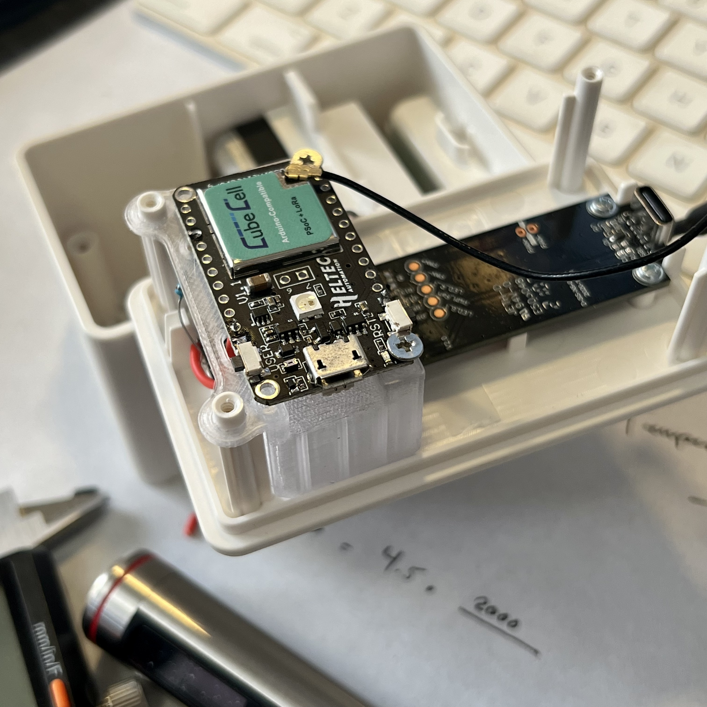
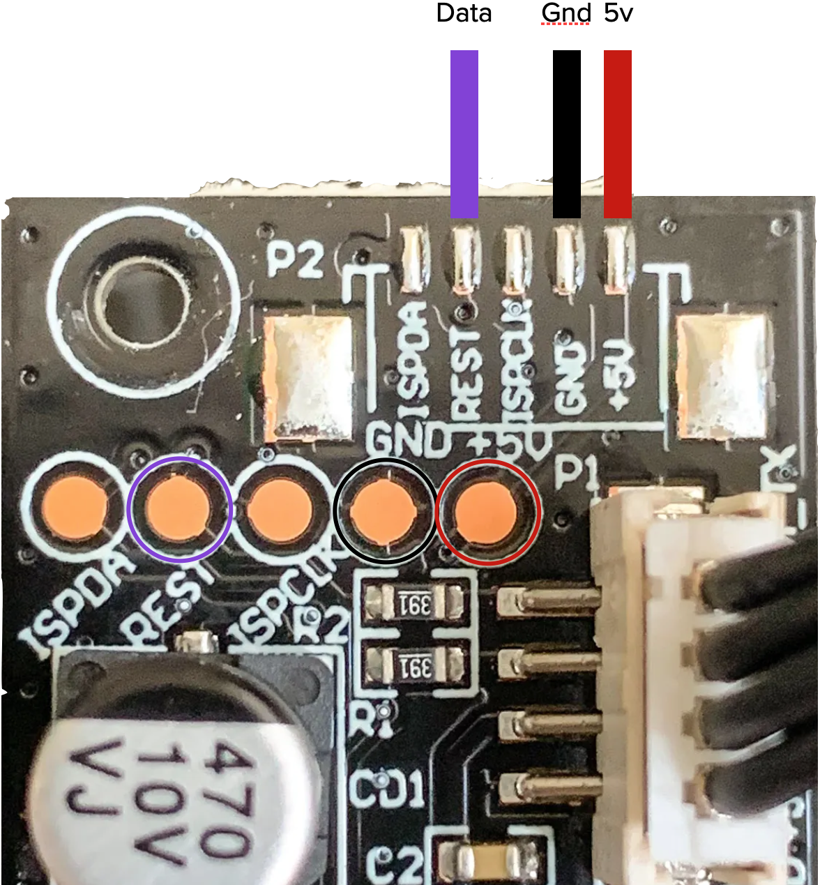
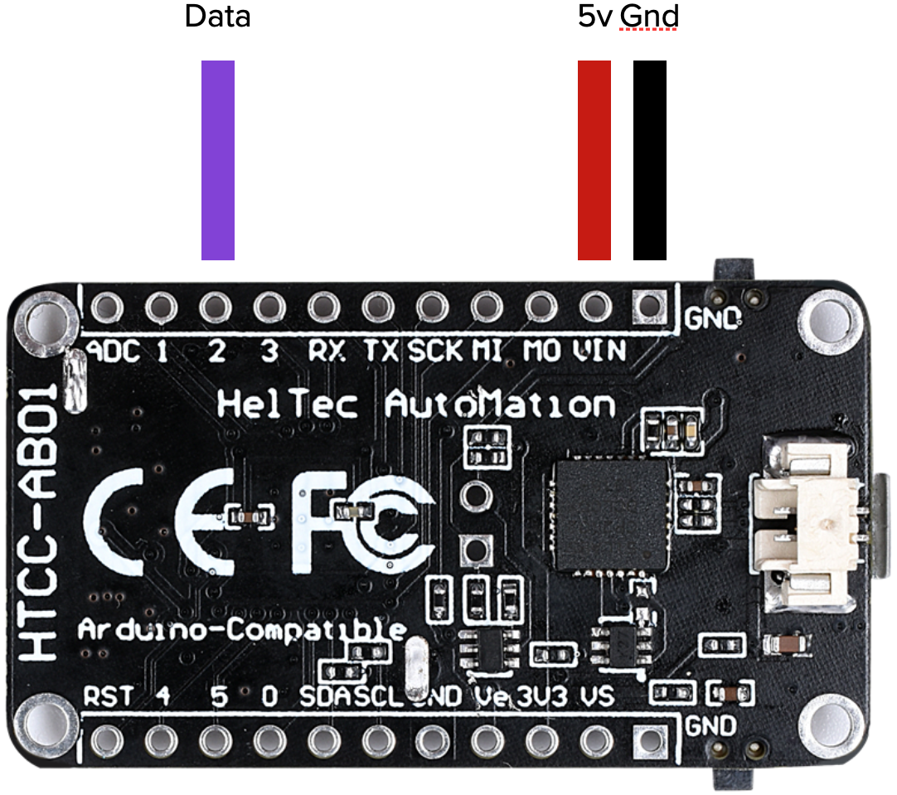
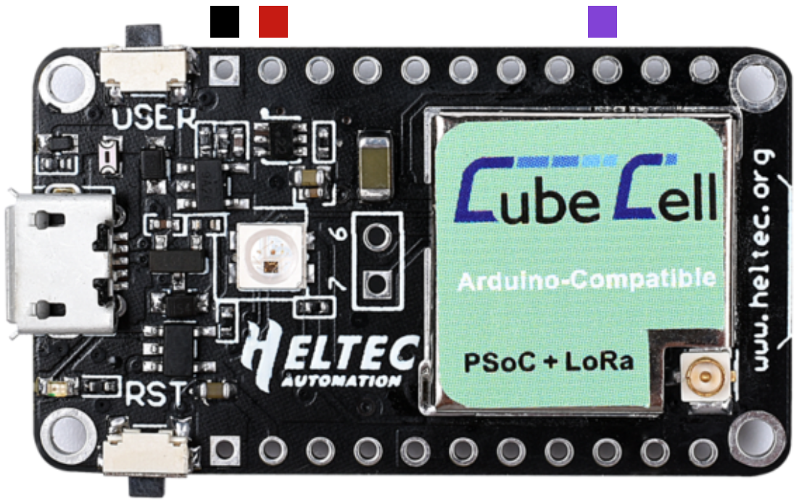

# Helium LoRaWAN connectivity for the Ikea VINDRIKTNING

This repository contains an Heltec CubeCell firmware, which adds Helium LoRaWAN connectivity to the Ikea VINDRIKTNING PM2.5 air quality sensor.
The modification doesn't interfere with normal operation of the IKEA device in any way.
The CubeCell just adds another data sink beside the colored LEDs.



The CubeCell seems to be 5V-tolerant, but just in case you can wire in the data line with a voltage divider.
## Prerequisites
To extend your air quality sensor, you will need

- A LoRaWAN-enabled dev board, in this case the [Heltec CubeCell HTCC-AB01](https://heltec.org/project/htcc-ab01/) ([US Domestic](https://shop.parleylabs.com/collections/iot-developers-products/products/cubecell-dev-board-by-heltec-htcc-ab01))
- Some short dupont cables
- A soldering iron
- A long PH0 Screwdriver (e.g. Wera 118022)

Fortunately, there is a lot of unused space in the enclosure, which fits the HTCC-AB01 well.
Also, everything we need is accessible via easy to solder testpoints.
## Hardware
To install, just unscrew the four visible screws in the back of the enclosure.

There are also three screws holding the IKEA PCB in place. These aren't necessary to remove since you can solder in-place, however personally, I'd recommend taking the board out of there since it will be easier to solder without fear of accidentally melting some plastic.



As you can see in this image, you'll need to solder wires to GND, 5V and the Testpoint that is connected to TX of the Particle Sensor.

Then just connect these Wires to GND, VIN (5V) and Pin 2 on the CubeCell.
<table>
  <tr>
    <td valign="bottom"></img></td>
    <td valign="bottom"></img></td>
  </tr>
</table>

[Optional] If you choose to include a voltage divider, you can wire it in as follows:


Done.
## Software
The firmware can be built and flashed with [VS Code](https://code.visualstudio.com) using the PlatformIO plugin. PRs welcome for any Arduino IDE support/testing.

You can follow the guide below to set up the PlatformIO environment and CubeCell board:

https://docs.helium.com/use-the-network/devices/development/heltec/cubecell-dev-board/platformio/

LoRaWAN network keys will need to be added in the code. All keys are MSB.
After keys are added; just build, flash, and you're done.

## Downlinks
### Update Interval
By default, the sensor will update on a 1 minute interval. LoRaWAN update interval is configurable via LoRaWAN downlink. Set the interval in hours, minutes, or both. Values are submitted in two separate buckets, `[hours]` and `[minutes]`. Values up to 255 are supported in each bucket. Use a tool like https://v2.cryptii.com/decimal/base64 to convert the two values into base64 before submitting them as a downlink in Helium Console. e.g.
```
"00 15" converts to "AA8=", representing 0 hrs, 15 min
```
Values are added, so `01 15` is equivalent to `00 75`. Further, `02 00` = `00 120` etc.

## Misc
The VINDRIKTNING consists of a custom(?) Cubic PM1006-like Sensor + another uC that does all that LED stuff, which talk via UART. Therefore, to add LoRaWAN connectivity, we just need to also listen to the TX of the Sensor and decode those messages.
The transitions from Green to Yellow and Yellow to Red in the Ikea firmware are at around 30μg/m³ and 100μg/m³. There is a great analysis of the sensor's capabilities [here](https://www.airgradient.com/resources/ikea-vindriktning-accuracy/).
## References and sources
- [Source Repo](https://github.com/Hypfer/esp8266-vindriktning-particle-sensor)
- [Sensor analysis](https://www.airgradient.com/resources/ikea-vindriktning-accuracy/)
- [@haxfleisch](https://twitter.com/haxfleisch) for their teardown of the device.
- [Gabriel Valky](https://github.com/gabonator) for the incredibly useful [LA104 custom firmware + tools](https://github.com/gabonator/LA104)
